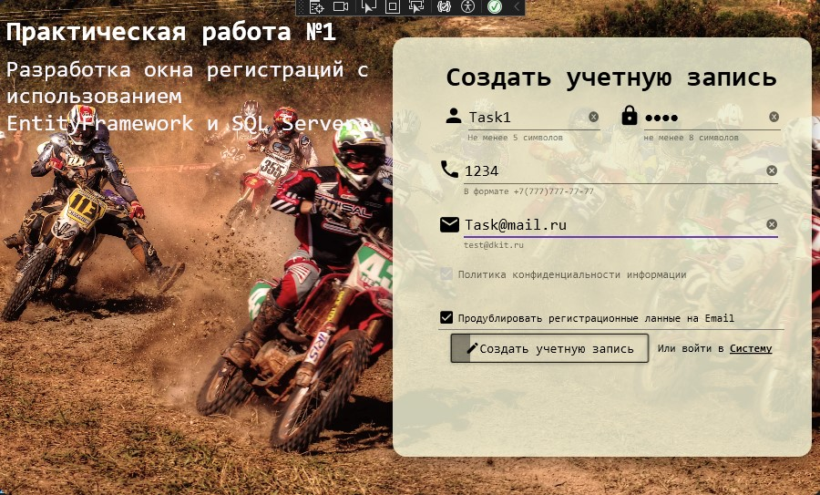

<h1>Задание 1. Разработка системы авторизации с использованием EF и SQLServer</h1>

Проект представляет собой систему авторизации на WPF с использованием Entity Framework Core и SQL Server. Приложение обеспечивает регистрацию новых пользователей и просмотр всех зарегестрированных пользователей.

Для запуска необходим SQLServer с базой данных и запустить "Task1SQLServer"

 
